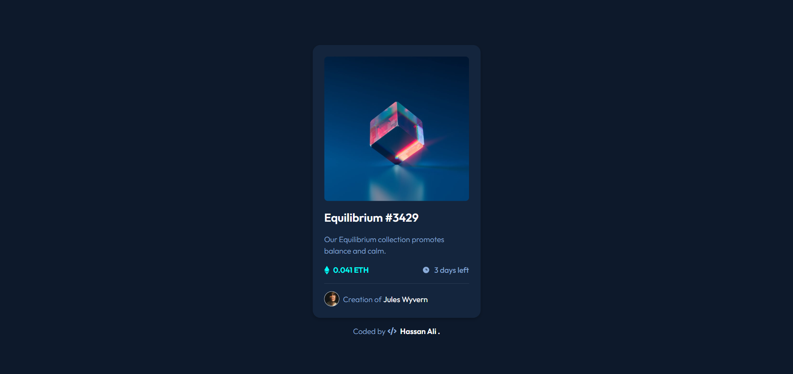

# Frontend Mentor - NFT Preview Card Component Solution

This is my solution to the [NFT Preview Card Component](https://www.frontendmentor.io/challenges/nft-preview-card-component-SbdUL_w0U) challenge on Frontend Mentor.  
Frontend Mentor challenges help you improve your front-end skills by building realistic projects.

---

## 📌 Overview

### 🔹 The Challenge

Users should be able to:

- View the NFT card **optimally on all devices**
- See smooth **hover and focus states** for interactive elements
- Experience a **clean, semantic, and accessible design**

---

## 🖼️ Screenshot

---

## 🌐 Live Demo

## 👉 [View Live Demo](https://hassan-ali-byte.github.io/nft-preview-card-component-main/)

## ⚙️ My Process

### Built With

- ✅ **Semantic HTML5 markup** (`<article>`, `<header>`, `<figure>`, `<figcaption>`, `<time>`)
- 🎨 **CSS Custom Properties** for consistent theme colors
- 🧩 **CSS Flexbox & Grid** for layout alignment
- 🎬 **CSS transitions** for smooth hover fade effects
- 📐 **Responsive units** (`rem` , `em`)

---

## ✨ Highlights

- ♿ Used **semantic HTML** — added an `h1` (for screen readers) and `h2` (for the card title) to improve accessibility.
- 🎨 Implemented **hover** and **focus-visible** overlay effects with smooth fade transitions.
- ⌨️ Added **keyboard and mobile accessibility** support using `:focus` and `:focus-visible` for non-mouse users.
- 🪞 Enhanced visual feedback with **image scaling** and **blur effects** on hover and focus for modern UI interaction.
- ⚡ Applied **smooth transitions** using `transform` and `filter` for better user experience.
- 👁️‍🗨️ Practiced **accessibility best practices** like `.sr-only` for hidden headings and proper `alt` text.

## 🔗 Resources

- [Josh Comeau – CSS Reset](https://www.joshwcomeau.com/css/custom-css-reset/)
- [Kevin Powell – Modern CSS Tutorials](https://www.youtube.com/@KevinPowell)

---

## 👨‍💻 Author

**Hassan Ali**

- Frontend Mentor – [@hassan-ali-byte](https://www.frontendmentor.io/profile/hassan-ali-byte)
- GitHub – [hassan-ali-byte](https://github.com/hassan-ali-byte)

---

✨ _Thanks for checking out my solution!_  
Your feedback and suggestions are always welcome 🙌
